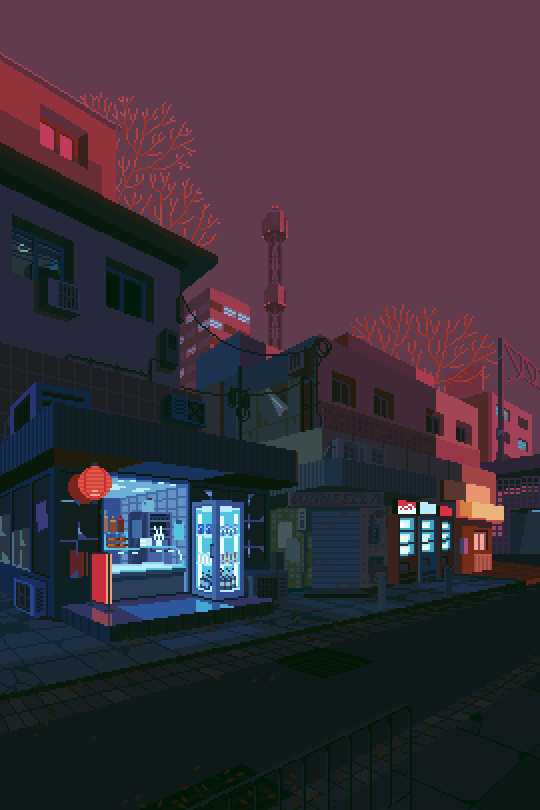

 ## Hi there ! 👋 **I'm Benjamin.👨‍💻** 

 

A self-thought French Javascript developer 
 
In the past i was able to work with programming technologies such as nodeJS, expressJS, discordJS and React

 

### 👋 About me

- 😉&nbsp;I love to learn new things everyday
- ✨&nbsp;I'm a Javascript Developer
- 🎓&nbsp;I'm currently learning WebDevelopment
- 🧿&nbsp;Hobbies other than coding : Playing video games, Table Tennis , Reading blogs , Watch Videos / Animes & Twitch.
- 📣&nbsp;I speak French natively as well as English fluently
- 📃&nbsp;Resume _(Coming soon..😉)_ 

 

---

### 🖥️  Languages 
    

---
### 🖱️  FRAMEWORKS 

---

### 🛢️  DATABASES 

---

### 🏷️  IDE & OS & TOOLS
 

---

 

## ⚙️  Current Public Projetcs

### PhoneMicrowave (A Discord Bot)

You can follow the progress on our Discord Server 

